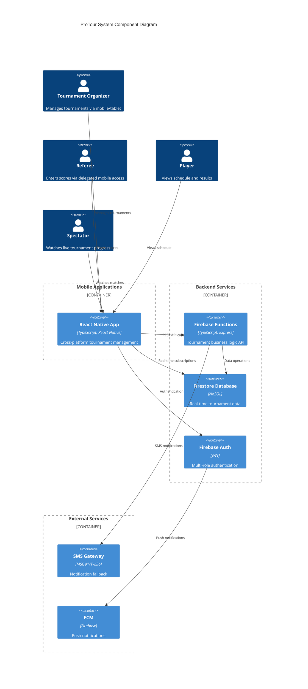

# Components

Based on the architectural patterns, tech stack, and data models from above, here are the major logical components across the fullstack ProTour system with clear boundaries and interfaces.

## TournamentEngine

**Responsibility:** Core tournament business logic including bracket generation, match progression, and tournament state management

**Key Interfaces:**
- `generateBracket(players: Player[], format: TournamentFormat): Match[]`
- `updateMatchScore(matchId: string, scores: MatchScore[], winnerId: string): TournamentProgression`
- `validateTournamentState(tournament: Tournament): ValidationResult`

**Dependencies:** Data models (Tournament, Match, Player), validation utilities

**Technology Stack:** TypeScript shared library, Firebase Functions for server-side operations, local computation for offline scenarios

## OfflineSyncManager  

**Responsibility:** Manages offline-first data synchronization, conflict resolution, and multi-device state coordination

**Key Interfaces:**
- `syncToCloud(): Promise<SyncResult>`
- `handleConflictResolution(conflicts: DataConflict[]): Resolution`
- `getOfflineCapabilityStatus(): OfflineStatus`

**Dependencies:** Firestore SDK, SQLite adapter, device storage, network connectivity detection

**Technology Stack:** React Native SQLite, Firestore offline persistence, Zustand for local state management

## AuthenticationManager

**Responsibility:** Multi-role authentication, session management, and device delegation for tournament access control

**Key Interfaces:**
- `authenticateUser(credentials: LoginCredentials): Promise<AuthResult>`
- `createDelegationToken(tournamentId: string, permissions: Permission[]): DelegationToken`
- `validateTournamentAccess(tournamentId: string, role: UserRole): boolean`

**Dependencies:** Firebase Auth, tournament access control rules, device token management

**Technology Stack:** Firebase Auth SDK, custom claims for role management, secure token generation

## NotificationService

**Responsibility:** Cross-platform notifications including push notifications, SMS fallback, and in-app alerts for tournament updates

**Key Interfaces:**
- `sendMatchNotification(players: Player[], matchInfo: MatchInfo): Promise<NotificationResult>`
- `broadcastTournamentUpdate(tournamentId: string, message: string): Promise<BroadcastResult>`
- `registerDeviceForNotifications(deviceToken: string, userId: string): Promise<void>`

**Dependencies:** Firebase Cloud Messaging, SMS gateway (MSG91), device token registry

**Technology Stack:** FCM for push notifications, HTTP client for SMS API, React Native push notification handling

## BracketVisualization

**Responsibility:** Interactive tournament bracket rendering, real-time updates, and responsive display across mobile and tablet devices

**Key Interfaces:**
- `renderBracket(tournament: Tournament, matches: Match[]): BracketComponent`
- `updateBracketInRealTime(matchUpdate: MatchUpdate): void`  
- `handleBracketInteraction(action: BracketAction): void`

**Dependencies:** Tournament and match data, real-time subscriptions, gesture handling

**Technology Stack:** React Native SVG for bracket rendering, React Native Gesture Handler, responsive layout calculations

## CSVImportProcessor

**Responsibility:** Player data import from CSV files with validation, duplicate detection, and error reporting

**Key Interfaces:**
- `processCSVFile(file: File, options: ImportOptions): Promise<ImportResult>`
- `validatePlayerData(playerData: PlayerData[]): ValidationResult`
- `resolveDuplicates(duplicates: DuplicatePlayer[], strategy: ResolutionStrategy): Player[]`

**Dependencies:** CSV parsing library, data validation rules, Firebase Storage for file handling

**Technology Stack:** PapaParse for CSV processing, Yup for data validation, Firebase Functions for server-side processing

## Component Diagrams

