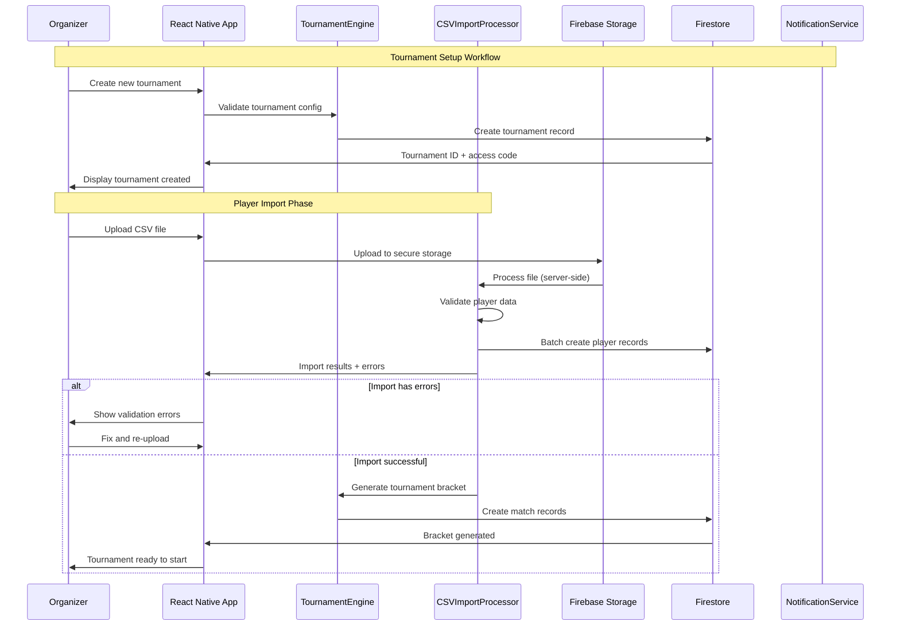
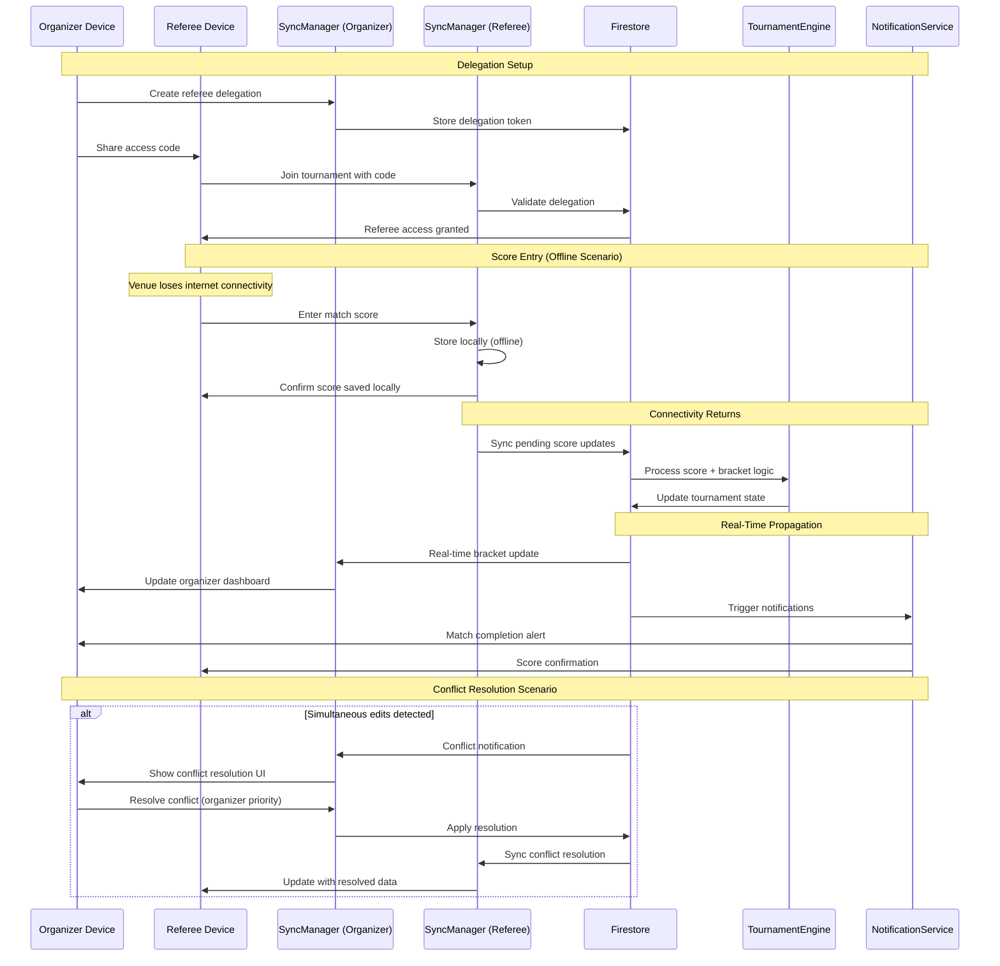
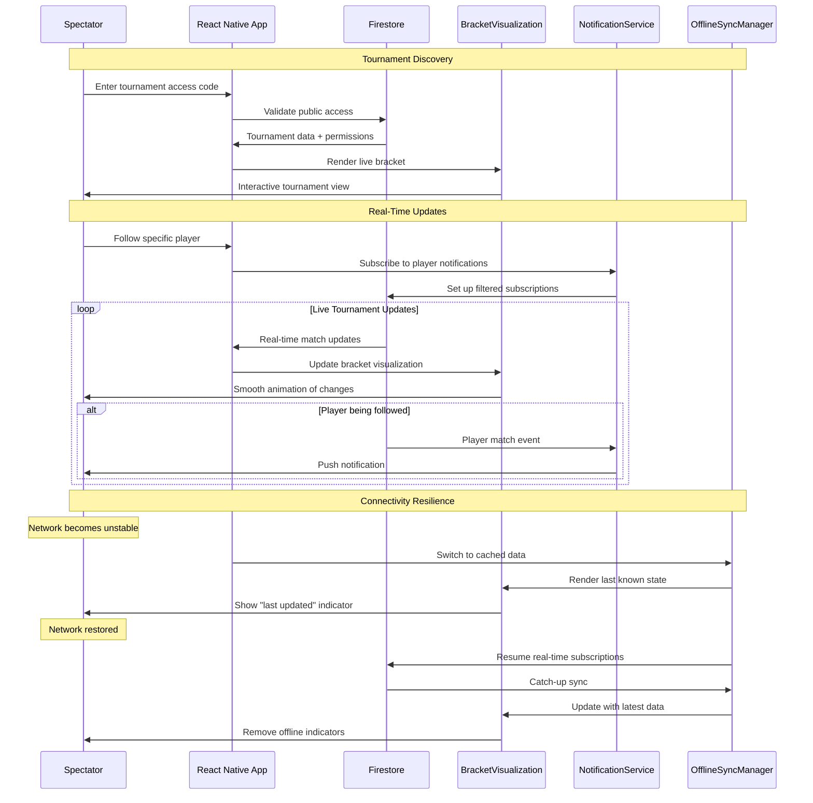
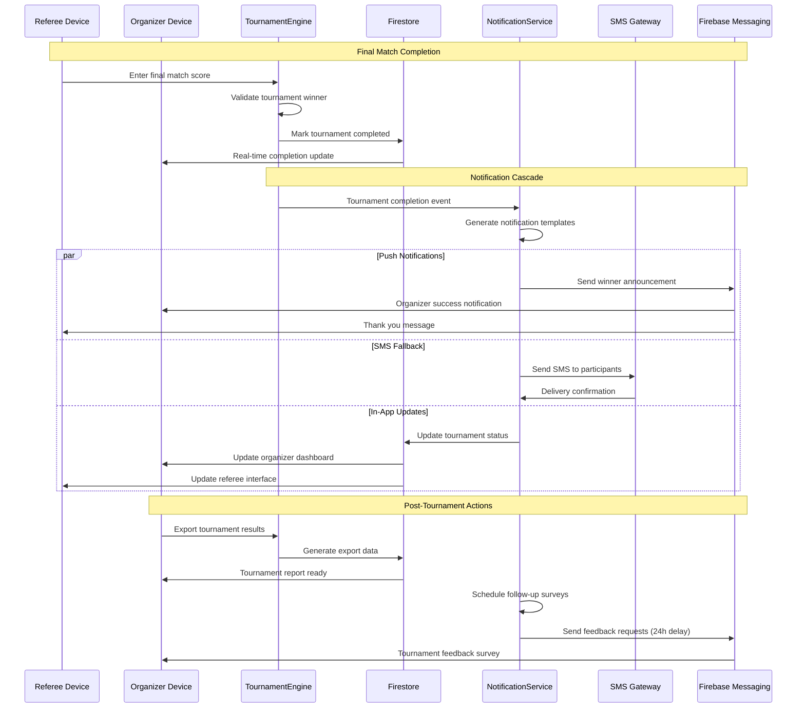

# Core Workflows

These sequence diagrams illustrate key system workflows that clarify architecture decisions and demonstrate complex multi-device interactions for ProTour's tournament management system.

## Tournament Creation and Player Import Workflow

## Multi-Device Score Entry and Real-Time Sync Workflow

## Live Tournament Spectator Experience Workflow

## Tournament Completion and Notification Cascade Workflow

