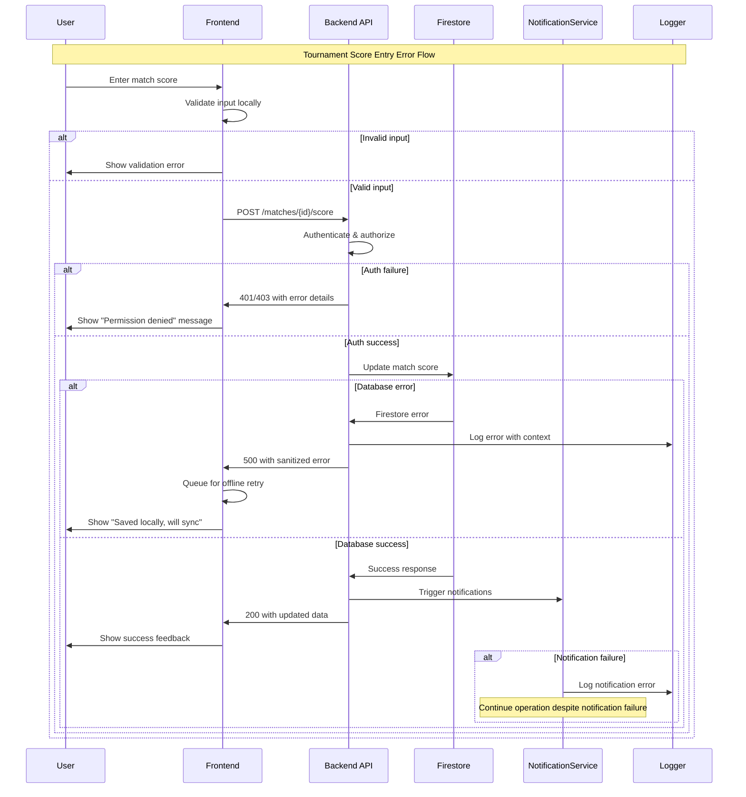

# Error Handling Strategy

Unified error handling across ProTour's fullstack architecture to ensure graceful degradation during tournament operations and clear error communication for different user roles.

## Error Flow



## Error Response Format

### Standard API Error Structure
```typescript
interface ApiError {
  error: {
    code: string;           // Machine-readable error code
    message: string;        // Human-readable error message
    details?: Record<string, any>;  // Additional error context
    timestamp: string;      // ISO timestamp
    requestId: string;      // Unique request identifier for tracking
    retryable?: boolean;    // Whether client should retry
    offlineSupported?: boolean;  // Whether operation can be queued offline
  };
}
```
