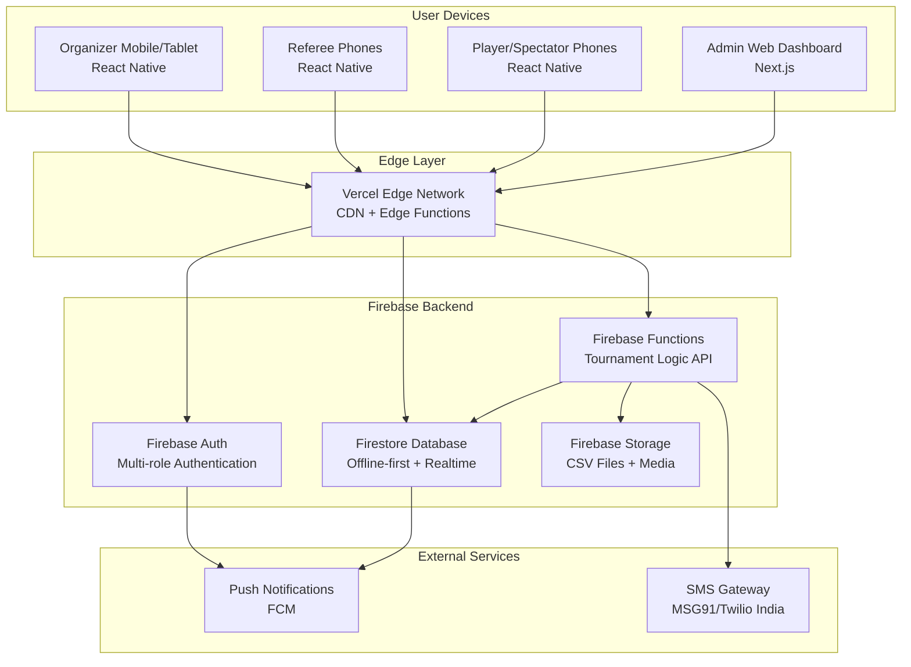

# High Level Architecture

## Technical Summary

ProTour employs a serverless-first fullstack architecture optimized for offline-first operation and real-time multi-device synchronization. The frontend utilizes React Native with local SQLite databases that sync with a cloud-based serverless backend via Firebase/Supabase realtime APIs. The system is deployed on a hybrid cloud approach using Vercel for frontend hosting and Firebase Functions for backend logic, enabling automatic scaling during tournament peaks while maintaining cost efficiency. This architecture directly addresses the PRD's core challenges of unreliable Indian venue connectivity, multi-device organizer workflows, and real-time tournament management by prioritizing local-first data storage with intelligent cloud synchronization.

## Platform and Infrastructure Choice

Based on the PRD's requirements for offline-first operation, real-time sync, and Indian market deployment, here are the top platform options:

**Option 1: Firebase + Vercel (Recommended)**
- **Pros:** Excellent offline support, built-in real-time database, proven scalability, strong Indian presence
- **Cons:** Vendor lock-in, pricing complexity at scale
- **Best for:** MVP rapid deployment with proven offline-first patterns

**Option 2: Supabase + Vercel** 
- **Pros:** Open-source, PostgreSQL-based, excellent real-time features, growing ecosystem
- **Cons:** Newer platform, less offline-first tooling, smaller community
- **Best for:** More control over data with modern developer experience

**Option 3: AWS Amplify Full Stack**
- **Pros:** Enterprise-grade, comprehensive services, excellent Indian infrastructure
- **Cons:** Higher complexity, steeper learning curve, potentially over-engineered for MVP
- **Best for:** Long-term scalability with enterprise requirements

**My Recommendation:** Firebase + Vercel for the following reasons:
- Firebase Firestore's offline-first capabilities directly address venue connectivity issues
- Built-in real-time synchronization handles multi-device tournament management
- Vercel's edge deployment improves performance in Indian markets
- Proven success with similar real-time applications
- Rapid MVP development timeline alignment

**Platform:** Firebase + Vercel  
**Key Services:** Firestore (offline-first DB), Firebase Functions (serverless backend), Firebase Auth, Vercel (frontend hosting)  
**Deployment Host and Regions:** Firebase Asia-South1 (Mumbai), Vercel Edge Network

## Repository Structure

For ProTour's complexity of cross-platform mobile, web admin, and shared real-time logic, a monorepo approach is optimal. This enables:
- Shared TypeScript types between frontend and backend
- Consistent offline-sync logic across React Native and web
- Unified deployment pipeline for coordinated releases
- Shared tournament business logic components

**Recommended Tool:** Nx for its excellent React Native + Next.js support and build optimization.

**Structure:** Nx Monorepo  
**Monorepo Tool:** Nx with integrated React Native and Next.js generators  
**Package Organization:** Apps (mobile, web-admin), libs (shared-types, tournament-engine, offline-sync)

## High Level Architecture Diagram

## Architectural Patterns

- **Offline-First Architecture:** All devices maintain local SQLite/IndexedDB with Firestore sync - _Rationale:_ Handles unreliable venue connectivity while maintaining real-time sync when available
- **Event Sourcing for Tournament State:** Tournament changes stored as events rather than state snapshots - _Rationale:_ Enables conflict resolution, audit trails, and reliable multi-device synchronization  
- **CQRS (Command Query Responsibility Segregation):** Separate read/write models for tournament data - _Rationale:_ Optimizes real-time spectator queries while maintaining write consistency for organizers
- **Multi-Device State Management:** Redux-like pattern synchronized across devices via Firestore - _Rationale:_ Ensures consistent UI state across organizer tablet and referee phones
- **Progressive Web App Fallback:** Service Worker implementation for basic functionality - _Rationale:_ Provides tournament viewing on unsupported devices without app installation
