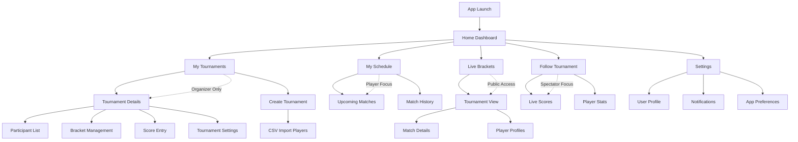
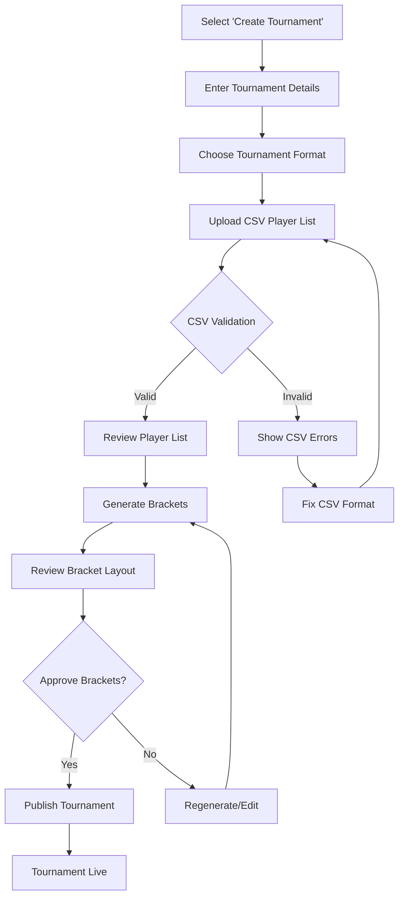
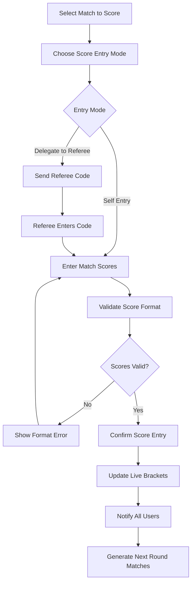
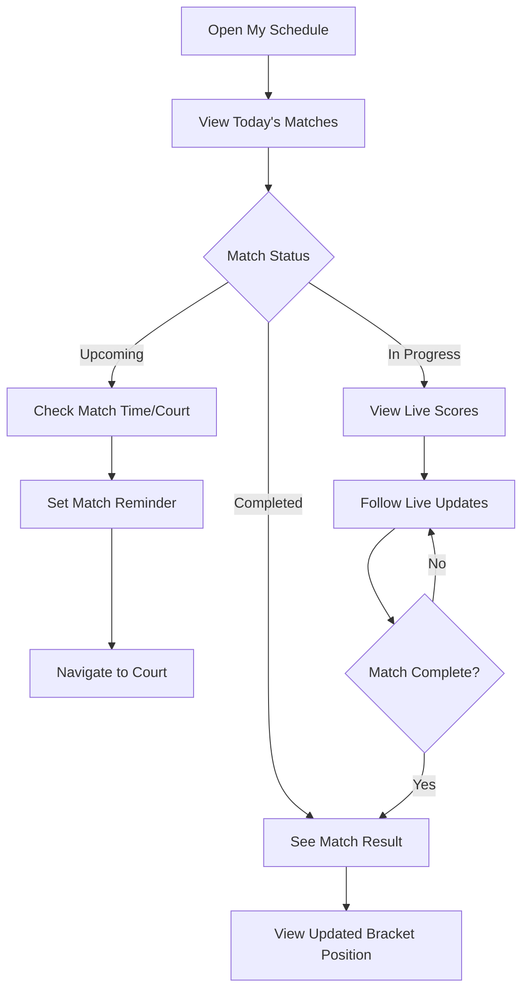
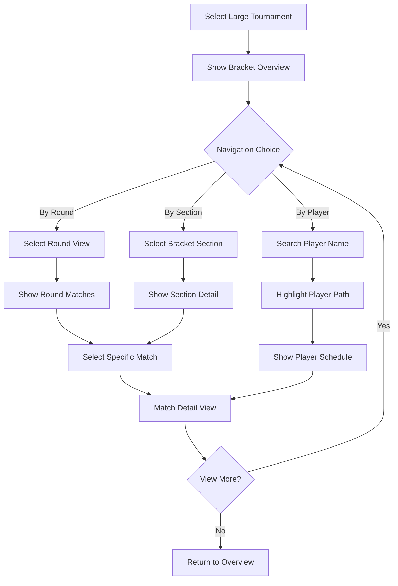

# ProTour UI/UX Specification

This document defines the user experience goals, information architecture, user flows, and visual design specifications for ProTour's user interface. It serves as the foundation for visual design and frontend development, ensuring a cohesive and user-centered experience.

## Overall UX Goals & Principles

### Target User Personas

**Alex the Club Organizer (Primary)**
- Time-poor volunteer in India running local racket sports tournaments
- Wants professional-looking events with reduced administrative burden
- Currently struggles with desktop-only tournament software creating bottlenecks
- Needs to delegate tasks like score entry to referees during events

**Maria the Competitive Player (Secondary)**
- Tech-savvy player in India participating in local tournaments
- Needs simple mobile interface to track match schedules and live results
- Values real-time updates to reduce anxiety about tournament progress
- Expects mobile-native experience across iOS and Android

**David the Dedicated Fan (Secondary)**  
- Parent or fan in India following player progress in tournaments
- Wants real-time access to match results from anywhere
- Needs public player profiles to understand tournament context
- Values live bracket updates without bothering organizers

### Usability Goals

- **Organizer Efficiency:** Reduce organizer's time spent on manual data entry and answering player questions during tournaments by 50%
- **Real-Time Transparency:** Eliminate information gaps through live bracket and score updates accessible to all users
- **Mobile-First Reliability:** Core tournament management functions work seamlessly on mobile devices with patchy network connectivity
- **Scalable Bracket Management:** Support tournament sizes from 8 to 128 players with clear, navigable bracket visualization
- **Delegation Success:** Enable organizers to assign score entry tasks to referees, reducing single-person bottlenecks

### Design Principles

1. **Mobile-First Always** - Every feature must work perfectly on smartphones; no desktop dependencies allowed
2. **Real-Time Transparency** - Live updates eliminate organizer interruptions and player anxiety about tournament status  
3. **Graceful Degradation** - Core functions remain accessible during network connectivity issues common in Indian venues
4. **Role-Based Clarity** - Interface adapts to show organizers, players, and spectators exactly what they need when they need it
5. **Future-Ready Flexibility** - Design patterns accommodate expansion to team sports while maintaining current user experience quality

### Change Log

| Date | Version | Description | Author |
|------|---------|-------------|--------|
| 2025-09-01 | 1.0 | Initial UX Goals & Principles | Sally (UX Expert) |

## Information Architecture (IA)

### Site Map / Screen Inventory

### Navigation Structure

**Primary Navigation:** Bottom tab bar with role-adaptive content
- **Home** - Dashboard showing relevant tournaments and quick actions
- **Brackets** - Live tournament brackets (public access)  
- **Schedule** - Personal schedule for players, tournament list for organizers
- **Profile** - User settings and tournament history

**Secondary Navigation:** Context-sensitive top navigation within sections
- Tournament-specific breadcrumbs when viewing bracket details
- Filter and search options for large tournaments (64+ players)
- Quick action buttons for organizers (Add Score, Edit Details)

**Breadcrumb Strategy:** Minimal mobile breadcrumbs focusing on tournament context
- Tournament Name > Section (e.g., "Spring Championship > Live Bracket")  
- Clear back navigation with tournament context preservation
- Deep-link support for sharing specific matches or bracket sections

## User Flows

### Organizer Tournament Setup Flow

**User Goal:** Create and populate a new tournament from CSV player data to generate live brackets

**Entry Points:** Home Dashboard > Create Tournament, My Tournaments > New Tournament

**Success Criteria:** Tournament is live with populated brackets, ready for score entry and public viewing

#### Flow Diagram

#### Edge Cases & Error Handling:
- CSV file contains duplicate player names → Show conflict resolution options
- Tournament size doesn't match bracket format → Suggest alternative formats or bye placements
- Network interruption during bracket generation → Save progress, allow resume
- Player count exceeds 128 limit → Show error with maximum tournament size

**Notes:** CSV template download link provided during upload step. Bracket preview shows match schedule and court assignments.

### Live Score Entry & Delegation Flow  

**User Goal:** Enter match scores in real-time and delegate score entry to referees during tournament

**Entry Points:** Tournament Details > Score Entry, Match notification > Enter Score

**Success Criteria:** Scores updated in real-time across all user types, brackets advance automatically

#### Flow Diagram

#### Edge Cases & Error Handling:
- Network drops during score entry → Cache locally, sync when reconnected
- Incorrect score entered → Allow score correction within 5-minute window
- Referee loses access code → Organizer can regenerate delegation
- Multiple simultaneous score entries → Show conflict resolution interface

**Notes:** Score entry supports various racket sport formats. Automatic bracket advancement with manual override option.

### Player Tournament Experience Flow

**User Goal:** Check match schedule, view live results, and track tournament progress

**Entry Points:** Home Dashboard, My Schedule tab, Tournament notification

**Success Criteria:** Player stays informed about matches without contacting organizer

#### Flow Diagram  

#### Edge Cases & Error Handling:
- Match time changes → Push notification with new schedule
- Tournament running late → Updated time estimates shown
- Player can't find court → Court map/directions integrated
- Bracket viewing on small screen → Collapsible/zoomable bracket sections

**Notes:** Integration with device calendar for match reminders. Offline viewing of previously loaded tournament data.

### Large Tournament Bracket Navigation Flow

**User Goal:** Navigate and understand bracket structure in 64-128 player tournaments

**Entry Points:** Live Brackets > Tournament Selection, Direct tournament link

**Success Criteria:** Users can find specific matches and players in complex bracket structures

#### Flow Diagram

#### Edge Cases & Error Handling:
- Player eliminated early → Show historical path and exit point
- Bracket sections don't load → Progressive loading with skeleton screens  
- Search returns multiple players → Disambiguate with additional details
- Screen too small for full bracket → Responsive sectioning with zoom controls

**Notes:** Bookmark favorite players for quick access. Share deep links to specific matches or bracket sections.

## Wireframes & Mockups

**Primary Design Files:** TBD - Recommended tools: Figma for collaborative design, Marvel/InVision for mobile prototyping

### Key Screen Layouts

#### Organizer Dashboard

**Purpose:** Central command center providing overview of active tournaments and quick access to critical actions during events

**Key Elements:**
- Active tournaments list with live status indicators (setup, in-progress, completed)
- Quick action buttons (Enter Score, View Brackets, Manage Players)
- Tournament timeline showing upcoming matches requiring attention
- Alert notifications for scoring conflicts or tournament delays

**Interaction Notes:** Swipe-to-reveal secondary actions on tournament cards. Pull-to-refresh for real-time updates. Priority notifications float above content.

**Design File Reference:** TBD - Organizer Dashboard wireframes

#### Live Bracket View (Scalable)

**Purpose:** Display tournament brackets from 8-128 players with intuitive navigation and real-time score updates

**Key Elements:**
- Collapsible tournament rounds with current round highlighted
- Player name cards with live match status (scheduled, in-progress, completed)
- Score display with visual win/loss indicators
- Zoom and pan controls for large tournaments
- Search/filter bar for player lookup

**Interaction Notes:** Tap player cards to view profiles. Pinch-to-zoom for tournament overview. Swipe between rounds. Real-time score animations on updates.

**Design File Reference:** TBD - Bracket layouts for 16, 32, 64, 128 player configurations

#### Score Entry Interface  

**Purpose:** Touch-optimized mobile interface for organizers and delegated referees to input match scores

**Key Elements:**
- Large, thumb-friendly score input buttons
- Player names clearly displayed with match context
- Score validation with format-specific rules (tennis sets, badminton games)
- Confirmation dialog before submitting scores
- Delegation status indicator when referee is entering

**Interaction Notes:** Haptic feedback on score buttons. Auto-advance to next incomplete match. Undo option with 30-second timeout. Network status indicator.

**Design File Reference:** TBD - Score entry flows for different racket sports

#### Player Schedule View

**Purpose:** Personal tournament schedule focusing on upcoming matches and recent results

**Key Elements:**
- Today's matches with prominent time/court display  
- Match status timeline (upcoming, current, completed)
- Quick bracket position indicator
- Calendar integration for match reminders
- Tournament context breadcrumbs

**Interaction Notes:** Tap matches for detailed view. Add to calendar gesture. Status-based color coding. Refresh indicator for live updates.

**Design File Reference:** TBD - Player-centric schedule layouts

#### Mobile Bracket Navigation (Large Tournaments)

**Purpose:** Navigate complex 64-128 player brackets on mobile devices with clear wayfinding

**Key Elements:**
- Bracket section overview with current position indicator
- Round-by-round navigation tabs
- Player path highlighting when selected
- Minimap for large bracket orientation  
- Share button for specific matches/sections

**Interaction Notes:** Horizontal swipe between rounds. Vertical scroll within rounds. Long-press for quick actions. Progressive loading of bracket sections.

**Design File Reference:** TBD - Large tournament navigation patterns

## Component Library / Design System

**Design System Approach:** Create ProTour-specific design system built on proven mobile UI patterns, optimized for tournament management workflows and real-time data updates

### Core Components

#### Tournament Card

**Purpose:** Display tournament information with live status indicators and quick actions

**Variants:** 
- Organizer view (with management actions)
- Player view (with personal match focus)  
- Spectator view (with follow/unfollow options)

**States:** Setup, Live, Paused, Completed, Error

**Usage Guidelines:** Maximum 2 tournaments visible per screen on mobile. Status indicators use color and animation for immediate recognition.

#### Bracket Node

**Purpose:** Individual match representation within tournament brackets, scalable across tournament sizes

**Variants:**
- Single elimination standard
- Double elimination (winner/loser brackets)
- Round robin group display
- Team match format (future)

**States:** Scheduled, In-Progress, Completed, Walkover, Conflict

**Usage Guidelines:** Touch target minimum 44px. Player names truncate with full names on tap. Score display adapts to sport format.

#### Score Input Panel

**Purpose:** Mobile-optimized score entry for organizers and delegated referees

**Variants:**
- Tennis (sets/games/points)
- Badminton (games/points)  
- Squash (games/points)
- Generic (simple win/loss)

**States:** Input, Validating, Confirmed, Error, Delegated

**Usage Guidelines:** Large touch targets (min 60px) for outdoor use. Haptic feedback on all interactions. Auto-save draft scores.

#### Player Profile Card

**Purpose:** Consistent player information display across all contexts

**Variants:**
- Minimal (name + status)
- Standard (name + record + ranking)
- Detailed (full profile with match history)

**States:** Active, Eliminated, Withdrawn, Not Found

**Usage Guidelines:** Avatar placeholder for missing photos. Consistent information hierarchy. Social sharing integration.

#### Status Indicator

**Purpose:** Real-time visual feedback for tournament, match, and system states

**Variants:**
- Dot indicators (small, inline)
- Badge indicators (prominent, actionable)
- Progress indicators (time-based)
- Network status (connection quality)

**States:** Success, Warning, Error, Loading, Offline

**Usage Guidelines:** Color-coded with text labels for accessibility. Animation indicates active/live states. Consistent placement patterns.

## Branding & Style Guide

### Visual Identity

**Brand Guidelines:** TBD - New brand identity to be developed focusing on professional tournament management with modern mobile-first approach

### Color Palette

| Color Type | Hex Code | Usage |
|------------|----------|-------|
| Primary | #1E40AF | Main actions, navigation highlights, tournament live indicators |
| Secondary | #059669 | Success states, completed matches, positive feedback |
| Accent | #DC2626 | Urgent actions, error states, critical alerts |
| Success | #10B981 | Match completions, successful operations, positive confirmations |
| Warning | #F59E0B | Schedule changes, network issues, attention-needed items |
| Error | #EF4444 | Failed operations, conflicts, destructive actions |
| Neutral | #374151, #6B7280, #9CA3AF, #D1D5DB, #F9FAFB | Text hierarchy, borders, backgrounds, disabled states |

### Typography

#### Font Families
- **Primary:** Inter (excellent mobile readability, supports multiple weights)
- **Secondary:** System fonts (-apple-system, Roboto) as fallbacks
- **Monospace:** SF Mono, Consolas (for score displays and technical data)

#### Type Scale

| Element | Size | Weight | Line Height |
|---------|------|--------|-------------|
| H1 | 28px | 700 | 1.2 |
| H2 | 24px | 600 | 1.3 |
| H3 | 20px | 600 | 1.4 |
| Body | 16px | 400 | 1.5 |
| Small | 14px | 400 | 1.4 |

### Iconography

**Icon Library:** Lucide React (consistent, sports-friendly icons with excellent mobile optimization)

**Usage Guidelines:** 
- Standard icons: 24px for primary actions, 20px for secondary
- Touch targets: Minimum 44px interactive area regardless of icon size  
- Sport-specific icons for tournament types (tennis racket, shuttlecock, etc.)
- System icons for universal actions (share, settings, notifications)

### Spacing & Layout

**Grid System:** 4px base unit system for consistent spacing across all components

**Spacing Scale:**
- 4px: Fine adjustments, border spacing
- 8px: Component internal padding
- 16px: Standard element spacing  
- 24px: Section spacing
- 32px: Major layout divisions
- 48px: Screen-level spacing

## Accessibility Requirements

### Compliance Target

**Standard:** WCAG 2.1 AA compliance with enhanced mobile accessibility considerations for tournament environments

### Key Requirements

**Visual:**
- Color contrast ratios: Minimum 4.5:1 for normal text, 3:1 for large text and UI elements
- Focus indicators: Visible 2px solid outline with 4.5:1 contrast against background
- Text sizing: Support system text scaling up to 200% without horizontal scrolling

**Interaction:**
- Keyboard navigation: Complete app functionality accessible via external keyboards on tablets
- Screen reader support: Semantic HTML structure with proper ARIA labels for all interactive elements
- Touch targets: Minimum 44px x 44px for all interactive elements, 8px spacing between targets

**Content:**
- Alternative text: Descriptive alt text for all meaningful images, icons, and visual indicators
- Heading structure: Logical H1-H6 hierarchy for screen reader navigation
- Form labels: Clear, descriptive labels associated with all input fields and controls

### Testing Strategy

**Automated Testing:** Integration with axe-core accessibility testing in CI/CD pipeline for catching common issues

**Manual Testing:** 
- Screen reader testing with iOS VoiceOver and Android TalkBack
- Keyboard navigation testing on tablet devices
- Color contrast validation in various lighting conditions
- Text scaling verification across different system settings

**User Testing:** Include users with disabilities in usability testing, particularly for critical flows like score entry and bracket navigation

## Responsiveness Strategy

### Breakpoints

| Breakpoint | Min Width | Max Width | Target Devices |
|------------|-----------|-----------|----------------|
| Mobile | 320px | 767px | Smartphones, primary target for all user types |
| Tablet | 768px | 1023px | iPads, Android tablets, enhanced bracket viewing |
| Desktop | 1024px | 1439px | Desktop browsers, admin/setup tasks |
| Wide | 1440px | - | Large displays, tournament display boards |

### Adaptation Patterns

**Layout Changes:** 
- Mobile: Single-column layouts, stacked navigation, full-width components
- Tablet: Two-column layouts where appropriate, side-by-side tournament cards, expanded bracket views
- Desktop: Three-column layouts, permanent sidebar navigation, multi-panel bracket displays
- Wide: Tournament presentation mode with large brackets and live scoreboards

**Navigation Changes:**
- Mobile: Bottom tab bar navigation, hamburger menu for secondary options
- Tablet: Side navigation drawer with persistent primary tabs, expanded context menus
- Desktop: Persistent sidebar navigation with full menu visibility
- Wide: Fixed navigation with tournament-specific quick actions prominently displayed

**Content Priority:**
- Mobile: Essential information only, progressive disclosure, swipe-based browsing
- Tablet: More context visible, side-by-side comparisons, detailed bracket sections
- Desktop: Full information hierarchy, comprehensive dashboards, multi-tournament views
- Wide: Tournament presentation focus, minimal UI chrome, maximum content visibility

**Interaction Changes:**
- Mobile: Touch-optimized, swipe gestures, large tap targets (60px for score entry)
- Tablet: Touch + stylus support, drag-and-drop functionality, hover states
- Desktop: Mouse + keyboard navigation, right-click context menus, keyboard shortcuts
- Wide: Presentation mode interactions, minimal user controls, focus on display

## Animation & Micro-interactions

### Motion Principles

**Purposeful Motion** - Every animation serves a functional purpose: providing feedback, indicating state changes, or guiding user attention. No decoration-only animations.

**Performance-First** - All animations must run smoothly on lower-end Android devices common in Indian market. 60fps target with graceful degradation.

**Respectful of Preferences** - Honor system-level reduced motion preferences. Provide alternative feedback mechanisms for users who disable animations.

**Tournament Context Appropriate** - Subtle, professional animations that work well in busy tournament environments without being distracting or overwhelming.

### Key Animations

- **Score Entry Feedback:** Button press confirmation with haptic feedback and brief scale animation (Duration: 100ms, Easing: ease-out)
- **Bracket Update Propagation:** Gentle highlight animation flowing through affected bracket sections when scores update (Duration: 500ms, Easing: ease-in-out)
- **Tournament Status Changes:** Color transition with pulse effect when tournaments go live or complete (Duration: 300ms, Easing: ease-in-out)
- **Pull-to-Refresh:** Elegant loading spinner with tournament-themed icon rotation (Duration: continuous, Easing: linear)
- **Match Card State Transitions:** Smooth fade between scheduled/in-progress/completed states (Duration: 250ms, Easing: ease-in-out)
- **Navigation Transitions:** Subtle slide animations between app sections maintaining context (Duration: 200ms, Easing: ease-out)
- **Error State Recovery:** Gentle shake animation for invalid score entries with color feedback (Duration: 400ms, Easing: ease-in-out)
- **Real-Time Data Sync:** Pulsing connectivity indicator showing live data flow (Duration: 1000ms, Easing: ease-in-out)

## Performance Considerations

### Performance Goals
- **Page Load:** Initial app launch under 3 seconds on 3G networks
- **Interaction Response:** All touch interactions respond within 100ms
- **Animation FPS:** Maintain 60fps for all animations on target devices

### Design Strategies

**Progressive Enhancement** - Core functionality works without animations. Enhanced experience with motion for capable devices.

**Efficient Updates** - Real-time bracket updates use minimal DOM manipulation. Component-level state management prevents unnecessary re-renders.

**Network Optimization** - Graceful degradation during poor connectivity. Critical tournament data prioritized over visual enhancements.

**Memory Management** - Animation cleanup prevents memory leaks during long tournament sessions. Efficient bracket rendering for large tournaments.

## Next Steps

### Immediate Actions

1. **Review and approve this UI/UX specification** with stakeholders and development team
2. **Create detailed visual designs** in Figma covering the 5 key screen layouts defined in wireframes section
3. **Develop interactive prototypes** for critical user flows, especially organizer tournament setup and score entry
4. **Conduct user validation sessions** with target personas (Alex, Maria, David) using prototypes
5. **Hand off to Design Architect** for technical frontend architecture planning
6. **Begin component library development** starting with Tournament Card and Bracket Node components

### Design Handoff Checklist

- [x] All user flows documented with entry points, success criteria, and edge cases
- [x] Component inventory complete with variants, states, and usage guidelines  
- [x] Accessibility requirements defined with specific WCAG 2.1 AA compliance targets
- [x] Responsive strategy clear with breakpoints and adaptation patterns for 320px-1440px+ screens
- [x] Brand guidelines incorporated with color palette, typography, and iconography specifications
- [x] Performance goals established with specific targets for 3G networks and lower-end devices

---

**Document Complete:** This UI/UX specification provides comprehensive foundation for ProTour's mobile tournament management interface, specifically designed for the Indian market with support for 8-128 player racket sports tournaments.
